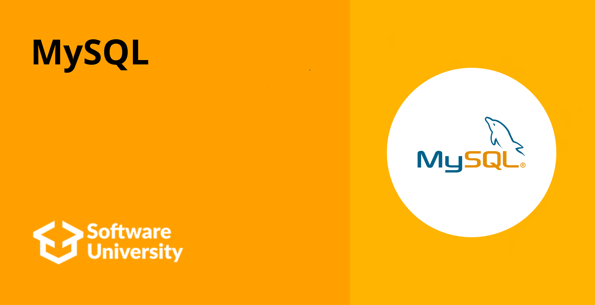

# Softuni MySQL

## Intro
SoftUni's MySQL course was my first introduction to databases. I learned how to make basic and more complex SELECT statements, how to make table relations, JOINs, procedures, transactions and many other interesting new things.

To learn more about the course you can check [Softuni](https://softuni.bg/)

## Course topics
### Data Definition and Datatypes
- [Lab](https://github.com/DenisBuserski/SoftUni-MySQL/tree/main/Data_Definition_And_Data_Types/Lab)
- [Exercise](https://github.com/DenisBuserski/SoftUni-MySQL/tree/main/Data_Definition_And_Data_Types/Exercise)
### Basic CRUD
- [Lab](https://github.com/DenisBuserski/SoftUni-MySQL/tree/main/Basic_CRUD/Lab)
- [Exercise](https://github.com/DenisBuserski/SoftUni-MySQL/tree/main/Basic_CRUD/Exercise)
### Built-in Functions
- [Lab](https://github.com/DenisBuserski/SoftUni-MySQL/tree/main/Built-in_Functions/Lab)
- [Exercise](https://github.com/DenisBuserski/SoftUni-MySQL/tree/main/Built-in_Functions/Exercise)
### Data Aggregation
- [Lab](https://github.com/DenisBuserski/SoftUni-MySQL/tree/main/Data_Aggregation/Lab)
- [Exercise](https://github.com/DenisBuserski/SoftUni-MySQL/tree/main/Data_Aggregation/Exercise)
### Table Relations
- [Lab](https://github.com/DenisBuserski/SoftUni-MySQL/tree/main/Table_Relations/Lab)
- [Exercise](https://github.com/DenisBuserski/SoftUni-MySQL/tree/main/Table_Relations/Exercise)
### Subqueries and JOINs
- [Lab](https://github.com/DenisBuserski/SoftUni-MySQL/tree/main/Subqueries_And_JOINs/Lab)
- [Exercise](https://github.com/DenisBuserski/SoftUni-MySQL/tree/main/Subqueries_And_JOINs/Exercise)
### Database Programmability and Transactions
- [Lab](https://github.com/DenisBuserski/SoftUni-MySQL/tree/main/Database_Programmability/Lab)
- [Exercise](https://github.com/DenisBuserski/SoftUni-MySQL/tree/main/Database_Programmability/Exercise)

## Exams
- [Database Basics MySQL Exam 13 February 2022](https://github.com/DenisBuserski/SoftUni-MySQL/tree/main/Exams/Database_Basics_MySQL_Exam_13_February_2022)
- [Database Basics MySQL Exam 20 June 2021](https://github.com/DenisBuserski/SoftUni-MySQL/tree/main/Exams/Database_Basics_MySQL_Exam_20_June_2021)
- [Database Basics MySQL Exam 21 Oct 2018](https://github.com/DenisBuserski/SoftUni-MySQL/tree/main/Exams/Database_Basics_MySQL_Exam_21_Oct_2018)
- [Database Basics MySQL Exam 9 Feb 2020](https://github.com/DenisBuserski/SoftUni-MySQL/tree/main/Exams/Database_Basics_MySQL_Exam_9%20Feb_2020)
- [Database Basics MySQL Exam 9 Jun 2019](https://github.com/DenisBuserski/SoftUni-MySQL/tree/main/Exams/Database_Basics_MySQL_Exam_9_Jun_2019)
- [Database Basics MySQL Retake Exam 06 August 2021](https://github.com/DenisBuserski/SoftUni-MySQL/tree/main/Exams/Database_Basics_MySQL_Retake_Exam_06_August_2021)
- [Database Basics MySQL Retake Exam 31 March 2020](https://github.com/DenisBuserski/SoftUni-MySQL/tree/main/Exams/Database_Basics_MySQL_Retake_Exam_31_March_2020)
- [Instagraph MySQL Exam](https://github.com/DenisBuserski/SoftUni-MySQL/tree/main/Exams/Instagraph-MySQL-Exam)

## Certificates
[MySQL Certificate](https://softuni.bg/certificates/details/123474/63ee1aa3)
